# Лабораторная работа: распознавание растровых изображений методом ближайших соседей

> Промежуточный отчёт по заданию № 4 раздела 3.13 учебного пособия.  
> Задание № 5, посвящённое выбросам и методу ODIN, будет добавлено после проведения соответствующих экспериментов.

## 1. Цель работы

Исследовать применение метода ближайших соседей (KNN) к распознаванию рукописных цифр MNIST и определить, как на качество классификации влияют:

- представление изображения в градациях серого или в бинарном виде;
- порог бинаризации и значения двух уровней яркости;
- равномерное и пространственно-неравномерное зашумление;
- используемая метрика расстояния;
- количество ближайших соседей `k`.

Дополнительной целью являлась разработка воспроизводимого экспериментального конвейера, сохраняющего численные результаты и графики для последующего анализа.

## 2. Постановка задачи

В задании № 4 на с. 69 учебного пособия требуется реализовать распознавание растровых изображений методом ближайшего соседа, программно создать равномерное и неравномерное зашумление, а затем сравнить процент распознавания бинарных и полутоновых изображений при разных нормах и значениях `k`.

В работе использован набор MNIST, содержащий изображения рукописных цифр размером `28 × 28` пикселей и метки классов от 0 до 9.

Все вычисления находятся в ноутбуке [`sample.ipynb`](sample.ipynb). Исходный набор хранится в [`data/mnist.npz`](data/mnist.npz), итоговые численные результаты — в [`results/knn_results.csv`](results/knn_results.csv), а полный набор графиков — в каталоге [`results/figures`](results/figures/).

## 3. Методология эксперимента

### 3.1. Формирование выборки

Исходные обучающая и тестовая части MNIST объединены в один массив из 70 000 изображений:

```python
with np.load("data/mnist.npz") as data:
    X = np.concatenate([data["x_train"], data["x_test"]], axis=0)
    y = np.concatenate([data["y_train"], data["y_test"]], axis=0)
```

Для массовых экспериментов из объединённого набора случайно выбрано по 1 000 изображений каждого класса. Итоговая выборка содержит 10 000 объектов и является сбалансированной.

Одна и та же выборка используется и как распознаваемая, и как эталонная. Для каждого объекта выполняется leave-one-out классификация: сам объект исключается из множества его соседей. В `scikit-learn` это обеспечивается вызовом `kneighbors(X=None)`.

Такой эксперимент измеряет согласованность объектов внутри выбранной совокупности, а не качество обобщения на отдельной ранее не встречавшейся тестовой выборке. Это соответствует принятой для лабораторной схеме, но должно учитываться при интерпретации accuracy.

Все случайные операции выполнялись с `seed=42`.

### 3.2. Представления изображений

Исследовалось 31 исходное представление:

- одно полутоновое представление с яркостями в диапазоне `[0, 1]`;
- 30 бинарных представлений: три порога бинаризации и десять пар уровней яркости для каждого порога.

Пороги бинаризации:

```text
8, 127, 248
```

Пары уровней:

| Группа | Пары `(low, high)` |
|---|---|
| Полный диапазон | `(0, 1)` |
| Нижняя часть | `(0, 0.05)`, `(0, 0.1)`, `(0, 0.2)` |
| Окрестность середины | `(0.475, 0.525)`, `(0.45, 0.55)`, `(0.4, 0.6)` |
| Верхняя часть | `(0.95, 1)`, `(0.9, 1)`, `(0.8, 1)` |

Бинаризация реализована следующим образом:

```python
def two_level_binarize(images, threshold=127, low=0, high=1):
    return np.where(images > threshold, high, low).astype(np.float32)
```

### 3.3. Равномерный шум

Каждый пиксель изменяется с одной и той же вероятностью

\[
p = 0.1.
\]

Для полутонового изображения новое значение выбранного пикселя равномерно генерируется в допустимой части интервала

\[
[x-\delta,\;x+\delta], \qquad \delta=0.75,
\]

с ограничением результата диапазоном `[0, 1]`. Для бинарного изображения выбранный пиксель переключается с `low` на `high` или обратно.

```python
selected = rng.random(images.shape) < noise_probability

if levels is None:
    lower = np.maximum(0.0, images - delta)
    upper = np.minimum(1.0, images + delta)
    noisy_values = rng.uniform(lower, upper).astype(np.float32)
else:
    low, high = levels
    noisy_values = np.where(np.isclose(images, low), high, low)

result = np.where(selected, noisy_values, images)
```

### 3.4. Пространственно-неравномерный контурный шум

В качестве неравномерного шума разработан контурный шум. Вероятность изменения пикселя зависит от локального перепада яркости: области около границ штрихов зашумляются сильнее однородного фона.

Сначала для пикселя суммируются абсолютные разности с горизонтальными и вертикальными соседями. Полученная сила контура нормируется отдельно для каждого изображения:

\[
g_{ij}=\frac{s_{ij}}{\max\limits_{m,n}s_{mn}}, \qquad 0\leq g_{ij}\leq1.
\]

Затем вычисляется индивидуальная вероятность изменения:

\[
p_{ij}=p_{\min}+(p_{\max}-p_{\min})g_{ij}^{\gamma},
\]

где в эксперименте использованы

\[
p_{\min}=0,\qquad p_{\max}=0.9,\qquad \gamma=0.5.
\]

```python
def contour_probability_map(images, p_min, p_max, gamma=1.0):
    strength = contour_strength(images)
    probabilities = p_min + (p_max - p_min) * strength ** gamma
    return probabilities.astype(np.float32)
```

Поскольку `gamma=0.5`, слабые ненулевые перепады усиливаются: например, `sqrt(0.25)=0.5`. Поэтому шум покрывает сравнительно широкую область около контура. Значения `gamma>1`, наоборот, сильнее концентрировали бы шум только на наиболее резких границах.

После построения карты вероятностей используется тот же механизм изменения значений, что и для равномерного шума.

### 3.5. Метрики расстояния

Каждое изображение разворачивается из матрицы `28 × 28` в вектор из 784 признаков. Исследовались пять вариантов расстояния.

1. Евклидово расстояние:

   \[
   d_2(x,y)=\sqrt{\sum_j(x_j-y_j)^2}.
   \]

2. Квадрат евклидова расстояния:

   \[
   d_2^2(x,y)=\sum_j(x_j-y_j)^2.
   \]

3. Манхэттенское расстояние:

   \[
   d_1(x,y)=\sum_j|x_j-y_j|.
   \]

4. Взвешенное евклидово расстояние:

   \[
   d_w(x,y)=\sqrt{\sum_jw_j(x_j-y_j)^2}.
   \]

   Вес пикселя квадратично возрастает от краёв изображения к центру. Он равен 1 на границе и приближается к 2 около центра:

   ```python
   vertical = np.linspace(-1.0, 1.0, height)[:, None]
   horizontal = np.linspace(-1.0, 1.0, width)[None, :]
   weights = 1.0 + (1.0 - horizontal**2) * (1.0 - vertical**2)
   ```

5. Расстояние Чебышёва:

   \[
   d_\infty(x,y)=\max_j|x_j-y_j|.
   \]

Квадрат евклидова расстояния не вычислялся повторно: квадратный корень является строго возрастающей функцией, поэтому обычное и квадратное евклидовы расстояния дают одинаковый порядок соседей.

### 3.6. KNN и оценка качества

Проверялись нечётные значения

```text
k = 1, 3, 5, 7, 9.
```

Соседи находились полным перебором (`algorithm="brute"`). Класс определялся как наиболее частая метка среди первых `k` соседей:

```python
features = images.reshape(len(images), -1)

model = NearestNeighbors(
    n_neighbors=max(k_values),
    algorithm="brute",
    metric=metric,
    n_jobs=-1,
)
model.fit(features)

neighbor_distances, neighbor_indices = model.kneighbors(
    X=None,
    return_distance=True,
)

prediction = mode(
    labels[neighbor_indices[:, :k]],
    axis=1,
    keepdims=False,
).mode
accuracy = np.mean(prediction == labels)
```

Каждое из 31 представлений исследовано без шума, с равномерным шумом и с контурным шумом. В результате получено:

\[
31\cdot3=93\text{ набора},
\]

\[
93\cdot5\text{ метрик}\cdot5\text{ значений }k=2325\text{ результатов}.
\]

## 4. Результаты

### 4.1. Лучшие результаты по группам

Для бинарных изображений accuracy усреднялась по десяти парам `low/high`, после чего выбиралась лучшая комбинация метрики и `k`.

| Представление | Шум | Лучшая метрика | `k` | Accuracy |
|---|---|---:|---:|---:|
| Серое | нет | взвешенная евклидова | 3 | **95.52%** |
| Серое | равномерный | взвешенная евклидова | 1 | **94.92%** |
| Серое | контурный | взвешенная евклидова | 3 | **94.77%** |
| Бинарное, `t=8` | нет | взвешенная евклидова | 3 | **95.17%** |
| Бинарное, `t=8` | равномерный | взвешенная евклидова | 7 | **92.06%** |
| Бинарное, `t=8` | контурный | взвешенная евклидова | 5 | **87.08%** |
| Бинарное, `t=127` | нет | взвешенная евклидова | 3 | **93.81%** |
| Бинарное, `t=127` | равномерный | взвешенная евклидова | 9 | **88.37%** |
| Бинарное, `t=127` | контурный | взвешенная евклидова | 5 | **74.31%** |
| Бинарное, `t=248` | нет | взвешенная евклидова | 1 | **77.31%** |
| Бинарное, `t=248` | равномерный | взвешенная евклидова | 9 | **60.62%** |
| Бинарное, `t=248` | контурный | взвешенная евклидова | 9 | **48.35%** |

### 4.2. Показательные графики

Каждый график содержит пять примеров изображений и зависимость accuracy от `k` для всех исследованных метрик.

#### Изображения в градациях серого

| Без шума | Равномерный шум | Контурный шум |
|---|---|---|
| 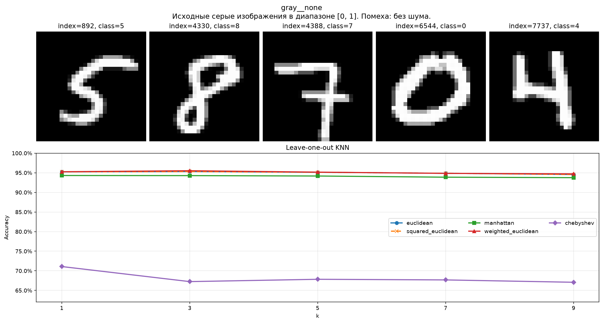 | 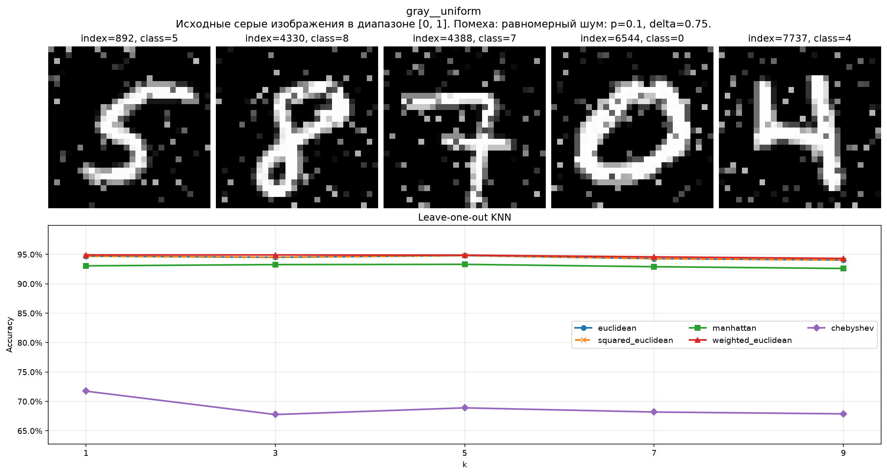 | 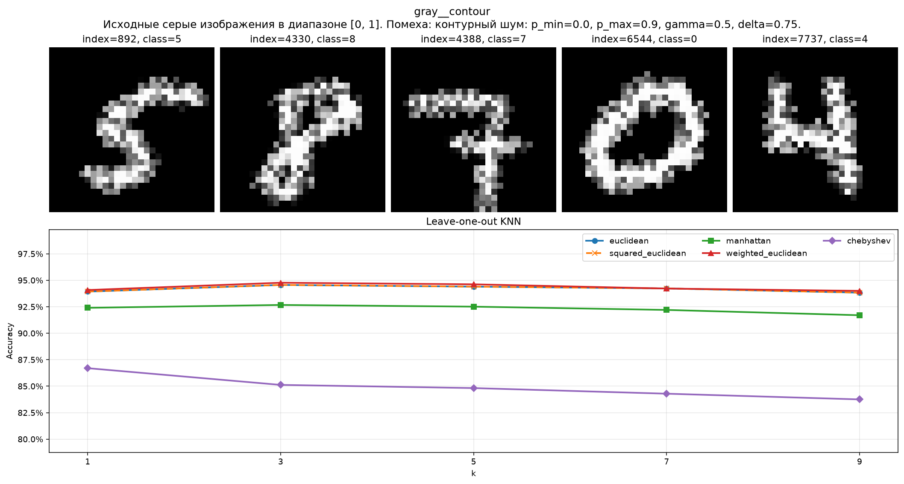 |

#### Бинаризация с порогом 8 и уровнями `(0, 1)`

| Без шума | Равномерный шум | Контурный шум |
|---|---|---|
| 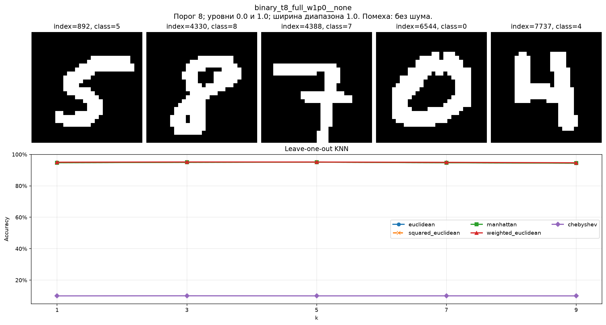 | 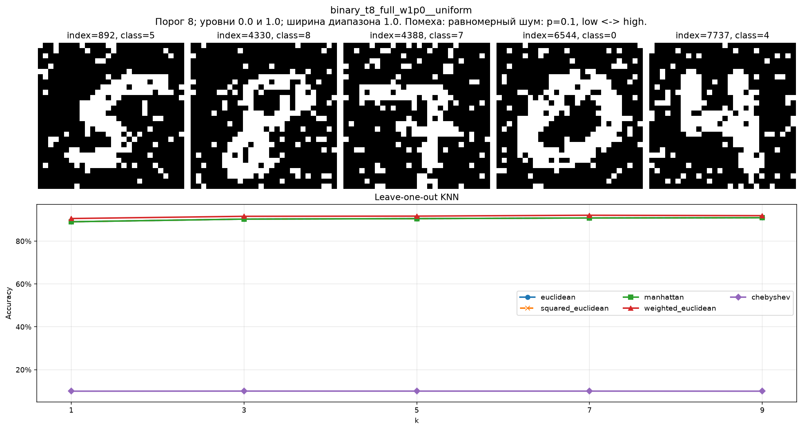 | 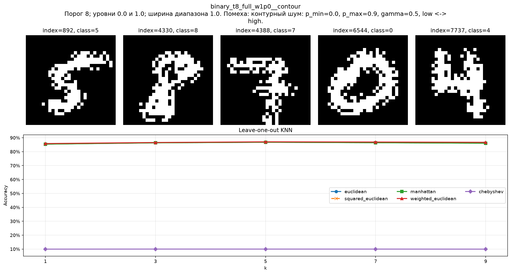 |

#### Бинаризация с порогом 127 и уровнями `(0, 1)`

| Без шума | Равномерный шум | Контурный шум |
|---|---|---|
| 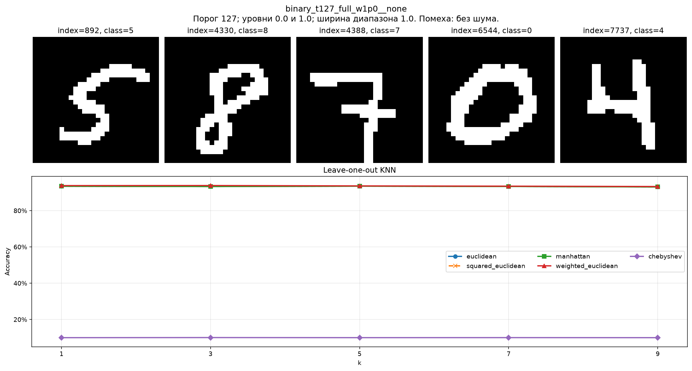 | 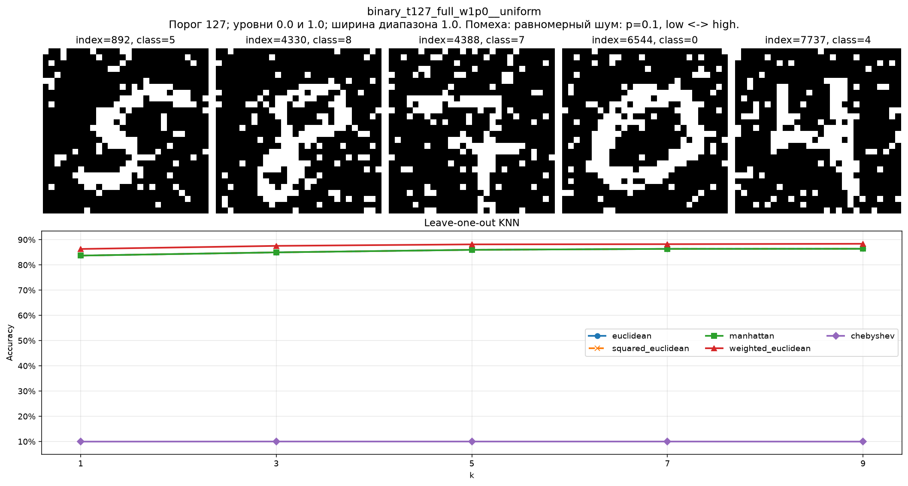 | 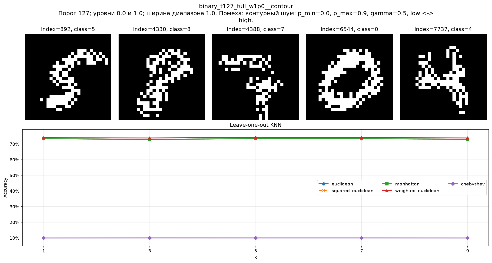 |

#### Бинаризация с порогом 248 и уровнями `(0, 1)`

| Без шума | Равномерный шум | Контурный шум |
|---|---|---|
| 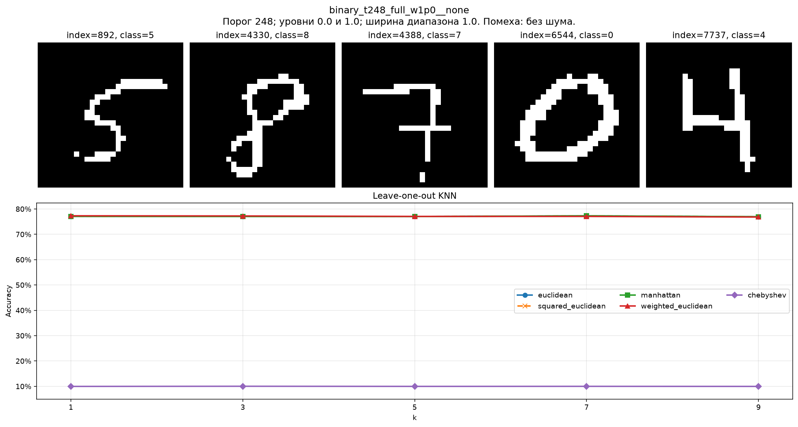 | 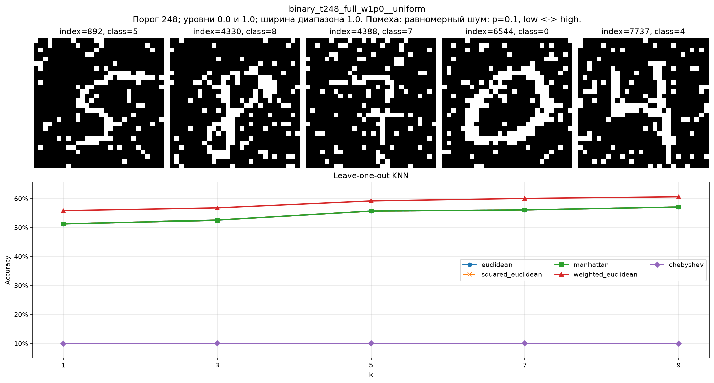 | 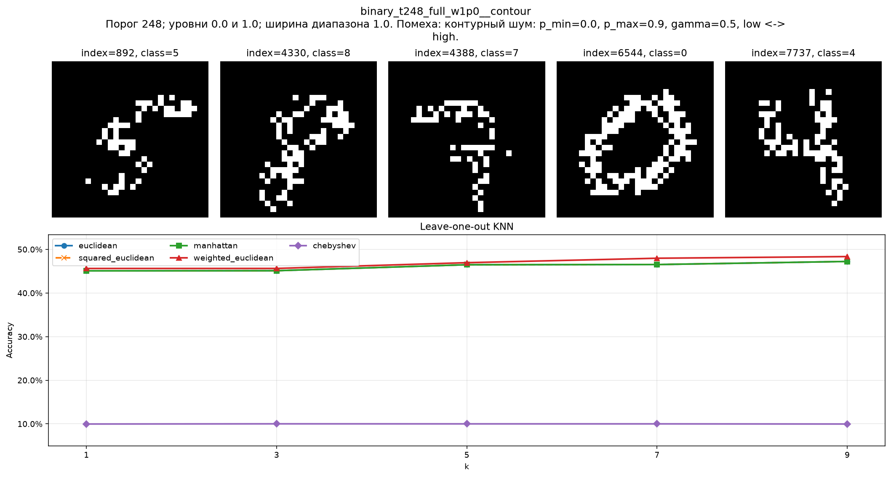 |

#### Сравнение уровней яркости при `threshold=127` и контурном шуме

| `(0, 1)` | `(0, 0.05)` | `(0.475, 0.525)` | `(0.95, 1)` |
|---|---|---|---|
|  | 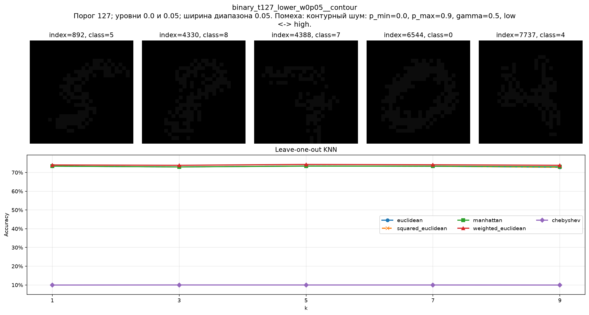 | 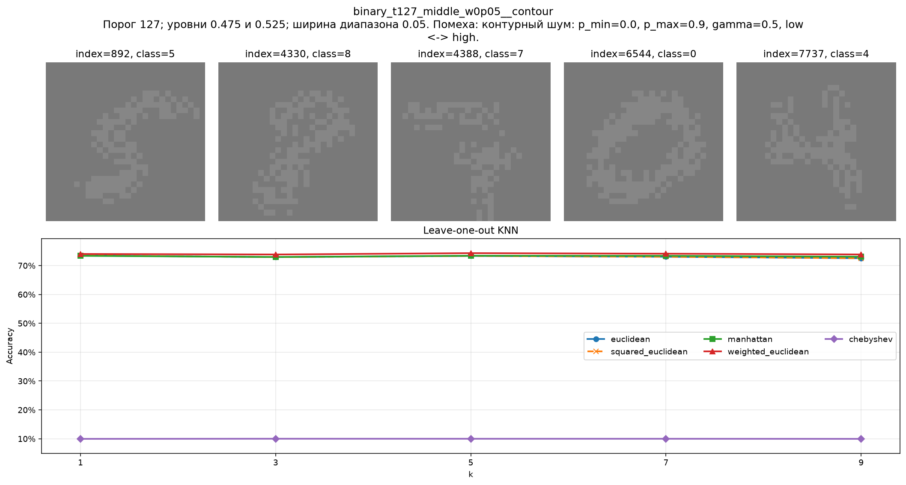 | 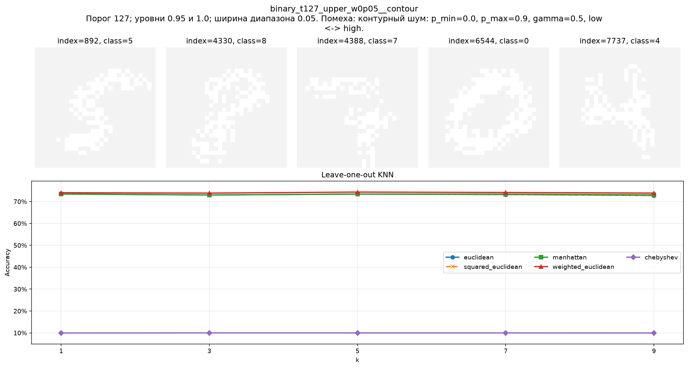 |

## 5. Наблюдения и закономерности

### 5.1. Полутоновое представление наиболее устойчиво к шуму

Если для каждой группы брать её лучший результат, равномерный шум уменьшил accuracy серых изображений только на 0.60 процентного пункта, а контурный — на 0.75 п. п.

| Представление | Снижение при равномерном шуме | Снижение при контурном шуме |
|---|---:|---:|
| Серое | 0.60 п. п. | 0.75 п. п. |
| Бинарное, `t=8` | 3.11 п. п. | 8.09 п. п. |
| Бинарное, `t=127` | 5.44 п. п. | 19.50 п. п. |
| Бинарное, `t=248` | 16.69 п. п. | 28.96 п. п. |

В бинарном представлении изменение выбранного пикселя полностью переключает его между двумя уровнями. У серого пикселя новое значение может оставаться близким к исходному, а информация о полутоне не обязательно теряется полностью.

Дополнительный расчёт по тем же 10 000 изображениям показывает это количественно:

| Шум и представление | Изменено пикселей | Среднее абсолютное изменение на пиксель |
|---|---:|---:|
| Равномерный, серое | 9.99% | 0.0367 |
| Равномерный, любое бинарное | 9.99% | 0.0999 |
| Контурный, серое | 15.33% | 0.0516 |
| Контурный, `t=8` | 11.47% | 0.1147 |
| Контурный, `t=127` | 11.31% | 0.1131 |
| Контурный, `t=248` | 9.05% | 0.0905 |

Контурный шум затронул больше серых пикселей, однако суммарная величина искажения осталась значительно ниже, чем у бинарных изображений.

### 5.2. Контурный шум опаснее для бинарных изображений

В бинарном изображении почти вся информация о форме цифры сосредоточена в геометрии границы между двумя уровнями. Контурный шум изменяет пиксели именно около этой границы, поэтому он разрушает связность штрихов и формирует ложные выступы и разрывы.

Равномерный шум распределяет искажения также по большому однородному фону. Значительная доля его изменений оказывается менее критичной для формы цифры. Поэтому при одинаковом порядке числа искажённых пикселей контурный шум снижает качество сильнее.

### 5.3. Высокий порог бинаризации резко ухудшает результат

При `threshold=8` белыми становятся почти все ненулевые пиксели сглаженного штриха. Цифра получается толстой и связной, а лучший результат без шума, 95.17%, почти совпадает с результатом серого изображения, 95.52%.

При `threshold=127` часть полутоновой границы удаляется. При `threshold=248` сохраняются только наиболее яркие внутренние части штрихов, поэтому изображение становится разреженным, а линии — тонкими и разорванными. В результате accuracy без шума падает до 77.31%.

Интересно, что контурный шум при `threshold=248` изменяет только около 9.05% пикселей — меньше, чем при других порогах, — но даёт худшее качество. Следовательно, определяющим является не только объём шума, но и отношение числа искажённых пикселей к количеству оставшихся информативных пикселей.

### 5.4. Абсолютное положение двух уровней почти не влияет на KNN

Для фиксированного порога любое двухуровневое изображение можно представить в виде

\[
x=low+(high-low)z,\qquad z\in\{0,1\}.
\]

Сдвиг `low` сокращается при вычислении разности двух изображений, а множитель `high-low` лишь масштабирует расстояния. Для евклидовой, манхэттенской, взвешенной евклидовой метрик и метрики Чебышёва порядок соседей теоретически не должен изменяться.

Карта контурного шума тоже инвариантна к паре уровней. Ненормированная сила контура умножается на `high-low`, после чего этот множитель сокращается при нормировке:

\[
\frac{(high-low)s}{(high-low)\max s}=\frac{s}{\max s}.
\]

При одинаковом `seed` зашумляются те же позиции. Поэтому почти совпадающие результаты разных пар `low/high` являются ожидаемым свойством эксперимента, а не случайностью.

Для Manhattan, Chebyshev и взвешенной евклидовой метрики результаты разных уровней практически полностью совпали. Небольшие отклонения появились преимущественно у обычной и квадратной евклидовой метрики:

| Порог | Максимальный разброс при контурном шуме |
|---:|---:|
| 8 | 0.47 п. п. |
| 127 | 1.10 п. п. |
| 248 | 1.63 п. п. |

Быстрое вычисление евклидова расстояния использует выражение

\[
\|x-y\|^2=\|x\|^2-2x^Ty+\|y\|^2.
\]

В верхнем диапазоне, например `(0.95, 1)`, общая составляющая значений велика, а полезный контраст равен только `0.05`. При вычислениях в `float32` вычитание близких больших чисел создаёт погрешность. На бинарных данных также часто встречаются равные расстояния, поэтому небольшая погрешность может изменить порядок соседей с ничьей. Наблюдаемые отклонения следует считать численным эффектом, а не преимуществом верхнего диапазона яркости.

### 5.5. Взвешенное евклидово расстояние чаще всего оказалось лучшим

Взвешенная евклидова метрика дала лучший результат на 89 из 93 наборов; на остальных четырёх лучшей была обычная евклидова. Если сравнивать её с обычной евклидовой метрикой отдельно для каждого набора и каждого `k`, взвешенная метрика оказалась лучше в 428 из 465 случаев.

Среднее преимущество составило около 1.02 процентного пункта, а максимальное — 4.64 п. п. При этом улучшение не абсолютно: в отдельных комбинациях результат был ниже максимум на 0.81 п. п.

Преимущество центрального взвешивания согласуется со структурой MNIST: цифры обычно расположены около центра кадра, а крайние пиксели чаще принадлежат фону или содержат малополезное искажение.

### 5.6. Оптимальное значение `k` растёт при усилении искажений

Распределение оптимальных `k` по 93 наборам получилось очень регулярным:

| Режим | `k=1` | `k=3` | `k=5` | `k=7` | `k=9` |
|---|---:|---:|---:|---:|---:|
| Без шума | 8 | 21 | 0 | 2 | 0 |
| Равномерный шум | 1 | 0 | 0 | 10 | 20 |
| Контурный шум | 0 | 1 | 20 | 0 | 10 |

Чистым изображениям чаще достаточно одного или трёх соседей. При равномерном шуме преобладают `k=7` и `k=9`: голосование большего числа объектов сглаживает случайные одиночные искажения.

Для контурного шума при порогах 8 и 127 чаще оптимально `k=5`, а при наиболее разрушительном пороге 248 — `k=9`. Это соответствует известному компромиссу KNN: малое `k` лучше сохраняет локальные особенности, а большое `k` уменьшает дисперсию решения и делает его устойчивее к шуму.

### 5.7. Квадрат евклидова расстояния не создаёт новую модель

Обычная и квадратная евклидовы метрики дали одинаковую accuracy во всех экспериментах. Возведение неотрицательных расстояний в квадрат не меняет их порядок, поэтому набор ближайших соседей остаётся тем же.

Эту метрику имеет смысл оставить в отчёте для формального сравнения предложенных норм, но её совпадение с обычной евклидовой метрикой является теоретически ожидаемым.

### 5.8. Расстояние Чебышёва непригодно для двухуровневых изображений

На всех бинарных наборах accuracy метрики Чебышёва составила приблизительно 10%, то есть находилась на уровне случайного выбора одного из десяти классов.

Для двух бинарных изображений расстояние Чебышёва имеет только два основных значения:

\[
d_\infty(x,y)=
\begin{cases}
0,&x=y,\\
high-low,&\text{если изображения отличаются хотя бы в одном пикселе}.
\end{cases}
\]

Практически любые два разных изображения отличаются хотя бы одним пикселем, поэтому почти все объекты оказываются равноудалёнными. Выбор соседей становится зависимым от порядка элементов и разрешения большого количества ничьих.

### 5.9. Контурный шум неожиданно улучшил Chebyshev на серых изображениях

Для серых изображений средняя accuracy Chebyshev составила:

- без шума — 68.19%;
- с равномерным шумом — 68.89%;
- с контурным шумом — 84.94%.

Лучший результат Chebyshev при контурном шуме достиг 86.70% при `k=1`. Для остальных метрик контурный шум немного ухудшает качество, поэтому нельзя утверждать, что шум в целом улучшает распознавание.

Вероятное объяснение состоит в том, что на исходных серых изображениях максимум покомпонентной разности часто насыщается близкими значениями, создавая много равных или почти равных расстояний. Локализованные случайные изменения около контуров расширяют распределение максимальных разностей и частично разрушают эти ничьи. Это объяснение является интерпретацией результата; для строгой проверки потребуется отдельно исследовать распределения расстояний и количество совпадений.

## 6. Промежуточный вывод

В работе реализован воспроизводимый эксперимент по распознаванию изображений MNIST методом ближайших соседей. Исследованы 93 варианта данных, образованные полутоновым и бинарными представлениями, тремя режимами шума, тремя порогами бинаризации и десятью парами уровней яркости. Для каждого варианта проверены пять метрик и пять значений `k`.

Наилучший результат — **95.52%** — получен на исходных серых изображениях со взвешенной евклидовой метрикой и `k=3`. Серое представление оказалось наиболее устойчивым к обоим типам шума. Бинаризация с низким порогом 8 без шума почти не уступила полутоновому представлению, однако бинарные изображения значительно сильнее пострадали от зашумления, особенно от шума, сосредоточенного около контуров.

Повышение порога бинаризации уменьшает количество сохраняемой информации и резко снижает точность. Абсолютные значения двух уровней яркости почти не влияют на соседство объектов: существенны структура бинарной маски и порог, а не положение уровней внутри диапазона `[0, 1]`. Небольшие отклонения евклидовой метрики для близких верхних уровней объясняются численной погрешностью и разрешением равных расстояний.

Наиболее успешной оказалась взвешенная евклидова метрика, повышающая вклад центральной области изображения. При усилении шума оптимальное `k` в целом увеличивается. Расстояние Чебышёва оказалось непригодным для бинарных изображений из-за вырождения почти всех расстояний в одно значение.

Полученные результаты закрывают экспериментальную часть задания № 4. Следующим этапом является выполнение задания № 5: генерация выбросов типа 0, реализация их поиска с помощью KNN и ODIN, выделение выбросов типов 1 и 2 и сравнение двух способов обнаружения.

## 7. Материалы и ссылки

### Файлы проекта

- [`sample.ipynb`](sample.ipynb) — весь код подготовки данных, зашумления, KNN и массовых экспериментов;
- [`results/knn_results.csv`](results/knn_results.csv) — 2 325 численных результатов;
- [`results/figures`](results/figures/) — 93 итоговых графика;
- [`data/mnist.npz`](data/mnist.npz) — локальная копия MNIST;
- `/home/mihanizzm/Downloads/mlnn.pdf`, с. 69–70 — формулировки заданий № 4 и № 5.

### Документация использованных библиотек

- [scikit-learn: `NearestNeighbors`](https://scikit-learn.org/stable/modules/generated/sklearn.neighbors.NearestNeighbors.html);
- [NumPy: `concatenate`](https://numpy.org/doc/stable/reference/generated/numpy.concatenate.html);
- [NumPy: `where`](https://numpy.org/doc/stable/reference/generated/numpy.where.html);
- [NumPy: `reshape`](https://numpy.org/doc/stable/reference/generated/numpy.reshape.html);
- [SciPy: `scipy.stats.mode`](https://docs.scipy.org/doc/scipy/reference/generated/scipy.stats.mode.html).

