# Лабораторная работа: распознавание растровых изображений и обнаружение выбросов

> Отчёт по заданиям № 4 и № 5 раздела 3.13 учебного пособия.

## 1. Цель работы

Исследовать применение метода ближайших соседей (KNN) к распознаванию рукописных цифр MNIST и определить, как на качество классификации влияют:

- представление изображения в градациях серого или в бинарном виде;
- порог бинаризации и значения двух уровней яркости;
- равномерное и пространственно-неравномерное зашумление;
- используемая метрика расстояния;
- количество ближайших соседей `k`.

Дополнительной целью являлась разработка воспроизводимого экспериментального конвейера, сохраняющего численные результаты и графики для последующего анализа.

Во второй части работы исследовалась идентификация искусственно созданных выбросов двумя способами:

- по несовпадению сохранённой метки объекта с прогнозом KNN;
- по малой входящей степени вершины в ориентированном графе ближайших соседей методом ODIN.

Требовалось сравнить методы на выбросах с разной геометрией и выяснить, как способ генерации аномального изображения влияет на возможность его обнаружения.

## 2. Постановка задачи

В задании № 4 на с. 69 учебного пособия требуется реализовать распознавание растровых изображений методом ближайшего соседа, программно создать равномерное и неравномерное зашумление, а затем сравнить процент распознавания бинарных и полутоновых изображений при разных нормах и значениях `k`.

В задании № 5 на с. 69–70 требуется сгенерировать обучающую выборку с заранее известными выбросами типа 0, реализовать поиск выбросов методами ближайшего соседа и ODIN и сравнить результаты. В терминологии пособия выброс типа 0, не обнаруженный методом ближайшего соседа, становится выбросом типа 1, а не обнаруженный методом ODIN — выбросом типа 2.

В работе использован набор MNIST, содержащий изображения рукописных цифр размером `28 × 28` пикселей и метки классов от 0 до 9.

Все вычисления находятся в ноутбуке [`sample.ipynb`](sample.ipynb). Исходный набор хранится в [`data/mnist.npz`](data/mnist.npz). Результаты задания № 4 записаны в [`results/knn_results.csv`](results/knn_results.csv), а результаты задания № 5 — в [`results/outliers/detection_results.csv`](results/outliers/detection_results.csv).

## 3. Методология эксперимента

### 3.1. Формирование выборки

Исходные обучающая и тестовая части MNIST объединены в один массив из 70 000 изображений:

```python
with np.load("data/mnist.npz") as data:
    X = np.concatenate([data["x_train"], data["x_test"]], axis=0)
    y = np.concatenate([data["y_train"], data["y_test"]], axis=0)
```

Для массовых экспериментов из объединённого набора случайно выбрано по 1 000 изображений каждого класса. Итоговая выборка содержит 10 000 объектов и является сбалансированной.

Одна и та же выборка используется и как распознаваемая, и как эталонная. Для каждого объекта выполняется leave-one-out классификация: сам объект исключается из множества его соседей. В `scikit-learn` это обеспечивается вызовом `kneighbors(X=None)`.

Такой эксперимент измеряет согласованность объектов внутри выбранной совокупности, а не качество обобщения на отдельной ранее не встречавшейся тестовой выборке. Это соответствует принятой для лабораторной схеме, но должно учитываться при интерпретации accuracy.

Все случайные операции выполнялись с `seed=42`.

### 3.2. Представления изображений

Исследовалось 31 исходное представление:

- одно полутоновое представление с яркостями в диапазоне `[0, 1]`;
- 30 бинарных представлений: три порога бинаризации и десять пар уровней яркости для каждого порога.

Пороги бинаризации:

```text
8, 127, 248
```

Пары уровней:

| Группа | Пары `(low, high)` |
|---|---|
| Полный диапазон | `(0, 1)` |
| Нижняя часть | `(0, 0.05)`, `(0, 0.1)`, `(0, 0.2)` |
| Окрестность середины | `(0.475, 0.525)`, `(0.45, 0.55)`, `(0.4, 0.6)` |
| Верхняя часть | `(0.95, 1)`, `(0.9, 1)`, `(0.8, 1)` |

Бинаризация реализована следующим образом:

```python
def two_level_binarize(images, threshold=127, low=0, high=1):
    return np.where(images > threshold, high, low).astype(np.float32)
```

### 3.3. Равномерный шум

Каждый пиксель изменяется с одной и той же вероятностью

\[
p = 0.1.
\]

Для полутонового изображения новое значение выбранного пикселя равномерно генерируется в допустимой части интервала

\[
[x-\delta,\;x+\delta], \qquad \delta=0.75,
\]

с ограничением результата диапазоном `[0, 1]`. Для бинарного изображения выбранный пиксель переключается с `low` на `high` или обратно.

```python
selected = rng.random(images.shape) < noise_probability

if levels is None:
    lower = np.maximum(0.0, images - delta)
    upper = np.minimum(1.0, images + delta)
    noisy_values = rng.uniform(lower, upper).astype(np.float32)
else:
    low, high = levels
    noisy_values = np.where(np.isclose(images, low), high, low)

result = np.where(selected, noisy_values, images)
```

### 3.4. Пространственно-неравномерный контурный шум

В качестве неравномерного шума разработан контурный шум. Вероятность изменения пикселя зависит от локального перепада яркости: области около границ штрихов зашумляются сильнее однородного фона.

Сначала для пикселя суммируются абсолютные разности с горизонтальными и вертикальными соседями. Полученная сила контура нормируется отдельно для каждого изображения:

\[
g_{ij}=\frac{s_{ij}}{\max\limits_{m,n}s_{mn}}, \qquad 0\leq g_{ij}\leq1.
\]

Затем вычисляется индивидуальная вероятность изменения:

\[
p_{ij}=p_{\min}+(p_{\max}-p_{\min})g_{ij}^{\gamma},
\]

где в эксперименте использованы

\[
p_{\min}=0,\qquad p_{\max}=0.9,\qquad \gamma=0.5.
\]

```python
def contour_probability_map(images, p_min, p_max, gamma=1.0):
    strength = contour_strength(images)
    probabilities = p_min + (p_max - p_min) * strength ** gamma
    return probabilities.astype(np.float32)
```

Поскольку `gamma=0.5`, слабые ненулевые перепады усиливаются: например, `sqrt(0.25)=0.5`. Поэтому шум покрывает сравнительно широкую область около контура. Значения `gamma>1`, наоборот, сильнее концентрировали бы шум только на наиболее резких границах.

После построения карты вероятностей используется тот же механизм изменения значений, что и для равномерного шума.

### 3.5. Метрики расстояния

Каждое изображение разворачивается из матрицы `28 × 28` в вектор из 784 признаков. Исследовались пять вариантов расстояния.

1. Евклидово расстояние:

   \[
   d_2(x,y)=\sqrt{\sum_j(x_j-y_j)^2}.
   \]

2. Квадрат евклидова расстояния:

   \[
   d_2^2(x,y)=\sum_j(x_j-y_j)^2.
   \]

3. Манхэттенское расстояние:

   \[
   d_1(x,y)=\sum_j|x_j-y_j|.
   \]

4. Взвешенное евклидово расстояние:

   \[
   d_w(x,y)=\sqrt{\sum_jw_j(x_j-y_j)^2}.
   \]

   Вес пикселя квадратично возрастает от краёв изображения к центру. Он равен 1 на границе и приближается к 2 около центра:

   ```python
   vertical = np.linspace(-1.0, 1.0, height)[:, None]
   horizontal = np.linspace(-1.0, 1.0, width)[None, :]
   weights = 1.0 + (1.0 - horizontal**2) * (1.0 - vertical**2)
   ```

5. Расстояние Чебышёва:

   \[
   d_\infty(x,y)=\max_j|x_j-y_j|.
   \]

Квадрат евклидова расстояния не вычислялся повторно: квадратный корень является строго возрастающей функцией, поэтому обычное и квадратное евклидовы расстояния дают одинаковый порядок соседей.

### 3.6. KNN и оценка качества

Проверялись нечётные значения

```text
k = 1, 3, 5, 7, 9.
```

Соседи находились полным перебором (`algorithm="brute"`). Класс определялся как наиболее частая метка среди первых `k` соседей:

```python
features = images.reshape(len(images), -1)

model = NearestNeighbors(
    n_neighbors=max(k_values),
    algorithm="brute",
    metric=metric,
    n_jobs=-1,
)
model.fit(features)

neighbor_distances, neighbor_indices = model.kneighbors(
    X=None,
    return_distance=True,
)

prediction = mode(
    labels[neighbor_indices[:, :k]],
    axis=1,
    keepdims=False,
).mode
accuracy = np.mean(prediction == labels)
```

Каждое из 31 представлений исследовано без шума, с равномерным шумом и с контурным шумом. В результате получено:

\[
31\cdot3=93\text{ набора},
\]

\[
93\cdot5\text{ метрик}\cdot5\text{ значений }k=2325\text{ результатов}.
\]

## 4. Результаты

### 4.1. Лучшие результаты по группам

Для бинарных изображений accuracy усреднялась по десяти парам `low/high`, после чего выбиралась лучшая комбинация метрики и `k`.

| Представление | Шум | Лучшая метрика | `k` | Accuracy |
|---|---|---:|---:|---:|
| Серое | нет | взвешенная евклидова | 3 | **95.52%** |
| Серое | равномерный | взвешенная евклидова | 1 | **94.92%** |
| Серое | контурный | взвешенная евклидова | 3 | **94.77%** |
| Бинарное, `t=8` | нет | взвешенная евклидова | 3 | **95.17%** |
| Бинарное, `t=8` | равномерный | взвешенная евклидова | 7 | **92.06%** |
| Бинарное, `t=8` | контурный | взвешенная евклидова | 5 | **87.08%** |
| Бинарное, `t=127` | нет | взвешенная евклидова | 3 | **93.81%** |
| Бинарное, `t=127` | равномерный | взвешенная евклидова | 9 | **88.37%** |
| Бинарное, `t=127` | контурный | взвешенная евклидова | 5 | **74.31%** |
| Бинарное, `t=248` | нет | взвешенная евклидова | 1 | **77.31%** |
| Бинарное, `t=248` | равномерный | взвешенная евклидова | 9 | **60.62%** |
| Бинарное, `t=248` | контурный | взвешенная евклидова | 9 | **48.35%** |

### 4.2. Показательные графики

Каждый график содержит пять примеров изображений и зависимость accuracy от `k` для всех исследованных метрик.

#### Изображения в градациях серого

| Без шума | Равномерный шум | Контурный шум |
|---|---|---|
|  |  |  |

#### Бинаризация с порогом 8 и уровнями `(0, 1)`

| Без шума | Равномерный шум | Контурный шум |
|---|---|---|
|  |  |  |

#### Бинаризация с порогом 127 и уровнями `(0, 1)`

| Без шума | Равномерный шум | Контурный шум |
|---|---|---|
|  |  |  |

#### Бинаризация с порогом 248 и уровнями `(0, 1)`

| Без шума | Равномерный шум | Контурный шум |
|---|---|---|
|  |  |  |

#### Сравнение уровней яркости при `threshold=127` и контурном шуме

| `(0, 1)` | `(0, 0.05)` | `(0.475, 0.525)` | `(0.95, 1)` |
|---|---|---|---|
|  |  |  |  |

## 5. Наблюдения и закономерности

### 5.1. Полутоновое представление наиболее устойчиво к шуму

Если для каждой группы брать её лучший результат, равномерный шум уменьшил accuracy серых изображений только на 0.60 процентного пункта, а контурный — на 0.75 п. п.

| Представление | Снижение при равномерном шуме | Снижение при контурном шуме |
|---|---:|---:|
| Серое | 0.60 п. п. | 0.75 п. п. |
| Бинарное, `t=8` | 3.11 п. п. | 8.09 п. п. |
| Бинарное, `t=127` | 5.44 п. п. | 19.50 п. п. |
| Бинарное, `t=248` | 16.69 п. п. | 28.96 п. п. |

В бинарном представлении изменение выбранного пикселя полностью переключает его между двумя уровнями. У серого пикселя новое значение может оставаться близким к исходному, а информация о полутоне не обязательно теряется полностью.

Дополнительный расчёт по тем же 10 000 изображениям показывает это количественно:

| Шум и представление | Изменено пикселей | Среднее абсолютное изменение на пиксель |
|---|---:|---:|
| Равномерный, серое | 9.99% | 0.0367 |
| Равномерный, любое бинарное | 9.99% | 0.0999 |
| Контурный, серое | 15.33% | 0.0516 |
| Контурный, `t=8` | 11.47% | 0.1147 |
| Контурный, `t=127` | 11.31% | 0.1131 |
| Контурный, `t=248` | 9.05% | 0.0905 |

Контурный шум затронул больше серых пикселей, однако суммарная величина искажения осталась значительно ниже, чем у бинарных изображений.

### 5.2. Контурный шум опаснее для бинарных изображений

В бинарном изображении почти вся информация о форме цифры сосредоточена в геометрии границы между двумя уровнями. Контурный шум изменяет пиксели именно около этой границы, поэтому он разрушает связность штрихов и формирует ложные выступы и разрывы.

Равномерный шум распределяет искажения также по большому однородному фону. Значительная доля его изменений оказывается менее критичной для формы цифры. Поэтому при одинаковом порядке числа искажённых пикселей контурный шум снижает качество сильнее.

### 5.3. Высокий порог бинаризации резко ухудшает результат

При `threshold=8` белыми становятся почти все ненулевые пиксели сглаженного штриха. Цифра получается толстой и связной, а лучший результат без шума, 95.17%, почти совпадает с результатом серого изображения, 95.52%.

При `threshold=127` часть полутоновой границы удаляется. При `threshold=248` сохраняются только наиболее яркие внутренние части штрихов, поэтому изображение становится разреженным, а линии — тонкими и разорванными. В результате accuracy без шума падает до 77.31%.

Интересно, что контурный шум при `threshold=248` изменяет только около 9.05% пикселей — меньше, чем при других порогах, — но даёт худшее качество. Следовательно, определяющим является не только объём шума, но и отношение числа искажённых пикселей к количеству оставшихся информативных пикселей.

### 5.4. Абсолютное положение двух уровней почти не влияет на KNN

Для фиксированного порога любое двухуровневое изображение можно представить в виде

\[
x=low+(high-low)z,\qquad z\in\{0,1\}.
\]

Сдвиг `low` сокращается при вычислении разности двух изображений, а множитель `high-low` лишь масштабирует расстояния. Для евклидовой, манхэттенской, взвешенной евклидовой метрик и метрики Чебышёва порядок соседей теоретически не должен изменяться.

Карта контурного шума тоже инвариантна к паре уровней. Ненормированная сила контура умножается на `high-low`, после чего этот множитель сокращается при нормировке:

\[
\frac{(high-low)s}{(high-low)\max s}=\frac{s}{\max s}.
\]

При одинаковом `seed` зашумляются те же позиции. Поэтому почти совпадающие результаты разных пар `low/high` являются ожидаемым свойством эксперимента, а не случайностью.

Для Manhattan, Chebyshev и взвешенной евклидовой метрики результаты разных уровней практически полностью совпали. Небольшие отклонения появились преимущественно у обычной и квадратной евклидовой метрики:

| Порог | Максимальный разброс при контурном шуме |
|---:|---:|
| 8 | 0.47 п. п. |
| 127 | 1.10 п. п. |
| 248 | 1.63 п. п. |

Быстрое вычисление евклидова расстояния использует выражение

\[
\|x-y\|^2=\|x\|^2-2x^Ty+\|y\|^2.
\]

В верхнем диапазоне, например `(0.95, 1)`, общая составляющая значений велика, а полезный контраст равен только `0.05`. При вычислениях в `float32` вычитание близких больших чисел создаёт погрешность. На бинарных данных также часто встречаются равные расстояния, поэтому небольшая погрешность может изменить порядок соседей с ничьей. Наблюдаемые отклонения следует считать численным эффектом, а не преимуществом верхнего диапазона яркости.

### 5.5. Взвешенное евклидово расстояние чаще всего оказалось лучшим

Взвешенная евклидова метрика дала лучший результат на 89 из 93 наборов; на остальных четырёх лучшей была обычная евклидова. Если сравнивать её с обычной евклидовой метрикой отдельно для каждого набора и каждого `k`, взвешенная метрика оказалась лучше в 428 из 465 случаев.

Среднее преимущество составило около 1.02 процентного пункта, а максимальное — 4.64 п. п. При этом улучшение не абсолютно: в отдельных комбинациях результат был ниже максимум на 0.81 п. п.

Преимущество центрального взвешивания согласуется со структурой MNIST: цифры обычно расположены около центра кадра, а крайние пиксели чаще принадлежат фону или содержат малополезное искажение.

### 5.6. Оптимальное значение `k` растёт при усилении искажений

Распределение оптимальных `k` по 93 наборам получилось очень регулярным:

| Режим | `k=1` | `k=3` | `k=5` | `k=7` | `k=9` |
|---|---:|---:|---:|---:|---:|
| Без шума | 8 | 21 | 0 | 2 | 0 |
| Равномерный шум | 1 | 0 | 0 | 10 | 20 |
| Контурный шум | 0 | 1 | 20 | 0 | 10 |

Чистым изображениям чаще достаточно одного или трёх соседей. При равномерном шуме преобладают `k=7` и `k=9`: голосование большего числа объектов сглаживает случайные одиночные искажения.

Для контурного шума при порогах 8 и 127 чаще оптимально `k=5`, а при наиболее разрушительном пороге 248 — `k=9`. Это соответствует известному компромиссу KNN: малое `k` лучше сохраняет локальные особенности, а большое `k` уменьшает дисперсию решения и делает его устойчивее к шуму.

### 5.7. Квадрат евклидова расстояния не создаёт новую модель

Обычная и квадратная евклидовы метрики дали одинаковую accuracy во всех экспериментах. Возведение неотрицательных расстояний в квадрат не меняет их порядок, поэтому набор ближайших соседей остаётся тем же.

Эту метрику имеет смысл оставить в отчёте для формального сравнения предложенных норм, но её совпадение с обычной евклидовой метрикой является теоретически ожидаемым.

### 5.8. Расстояние Чебышёва непригодно для двухуровневых изображений

На всех бинарных наборах accuracy метрики Чебышёва составила приблизительно 10%, то есть находилась на уровне случайного выбора одного из десяти классов.

Для двух бинарных изображений расстояние Чебышёва имеет только два основных значения:

\[
d_\infty(x,y)=
\begin{cases}
0,&x=y,\\
high-low,&\text{если изображения отличаются хотя бы в одном пикселе}.
\end{cases}
\]

Практически любые два разных изображения отличаются хотя бы одним пикселем, поэтому почти все объекты оказываются равноудалёнными. Выбор соседей становится зависимым от порядка элементов и разрешения большого количества ничьих.

### 5.9. Контурный шум неожиданно улучшил Chebyshev на серых изображениях

Для серых изображений средняя accuracy Chebyshev составила:

- без шума — 68.19%;
- с равномерным шумом — 68.89%;
- с контурным шумом — 84.94%.

Лучший результат Chebyshev при контурном шуме достиг 86.70% при `k=1`. Для остальных метрик контурный шум немного ухудшает качество, поэтому нельзя утверждать, что шум в целом улучшает распознавание.

Вероятное объяснение состоит в том, что на исходных серых изображениях максимум покомпонентной разности часто насыщается близкими значениями, создавая много равных или почти равных расстояний. Локализованные случайные изменения около контуров расширяют распределение максимальных разностей и частично разрушают эти ничьи. Это объяснение является интерпретацией результата; для строгой проверки потребуется отдельно исследовать распределения расстояний и количество совпадений.

## 6. Вывод по заданию № 4

В работе реализован воспроизводимый эксперимент по распознаванию изображений MNIST методом ближайших соседей. Исследованы 93 варианта данных, образованные полутоновым и бинарными представлениями, тремя режимами шума, тремя порогами бинаризации и десятью парами уровней яркости. Для каждого варианта проверены пять метрик и пять значений `k`.

Наилучший результат — **95.52%** — получен на исходных серых изображениях со взвешенной евклидовой метрикой и `k=3`. Серое представление оказалось наиболее устойчивым к обоим типам шума. Бинаризация с низким порогом 8 без шума почти не уступила полутоновому представлению, однако бинарные изображения значительно сильнее пострадали от зашумления, особенно от шума, сосредоточенного около контуров.

Повышение порога бинаризации уменьшает количество сохраняемой информации и резко снижает точность. Абсолютные значения двух уровней яркости почти не влияют на соседство объектов: существенны структура бинарной маски и порог, а не положение уровней внутри диапазона `[0, 1]`. Небольшие отклонения евклидовой метрики для близких верхних уровней объясняются численной погрешностью и разрешением равных расстояний.

Наиболее успешной оказалась взвешенная евклидова метрика, повышающая вклад центральной области изображения. При усилении шума оптимальное `k` в целом увеличивается. Расстояние Чебышёва оказалось непригодным для бинарных изображений из-за вырождения почти всех расстояний в одно значение.

Полученные результаты закрывают экспериментальную часть задания № 4.

## 7. Методология задания № 5

### 7.1. Типы выбросов

В эксперименте различаются три связанных, но не тождественных понятия.

- **Выброс типа 0** — искусственно созданное изображение, которое заранее объявлено выбросом независимо от результатов алгоритмов.
- **Выброс типа 1** — выброс типа 0, который KNN не обнаружил как аномальный при выбранном `k`.
- **Выброс типа 2** — выброс типа 0, который ODIN не обнаружил при выбранных `k` и пороге `T`.

Таким образом, тип 0 является свойством способа построения экспериментальной выборки, а типы 1 и 2 описывают ошибки конкретных детекторов. Одно и то же изображение может оказаться выбросом типа 1 при одном `k`, но быть обнаружено при другом. Аналогично, принадлежность к типу 2 зависит одновременно от `k` и `T`.

Для оценки детекторов использовалась известная маска выбросов типа 0. Обнаруженный выброс типа 0 считался истинно положительным результатом, а обычное изображение, ошибочно объявленное выбросом, — ложноположительным.

### 7.2. Генерация исходных пар

Как и в задании № 4, из MNIST была выбрана сбалансированная совокупность из 10 000 серых изображений: по 1 000 объектов каждого класса. Значения пикселей приведены к диапазону `[0, 1]` и представлены типом `float32`.

Для генерации выбросов случайно выбирались пары изображений разных классов. Первое изображение считалось основным и определяло сохранённую метку результата, второе вносило признаки другого класса. Для каждого класса основного изображения создавалось по 100 пар, поэтому каждый полный пул содержал 1 000 выбросов.

```python
primary_indices = np.concatenate([
    rng.choice(
        np.flatnonzero(labels == class_label),
        size=pairs_per_class,
        replace=False,
    )
    for class_label in classes
])

secondary_indices = np.asarray([
    rng.choice(np.flatnonzero(labels != primary_class))
    for primary_class in labels[primary_indices]
])
```

Одни и те же пары родителей применялись для построения обоих видов выбросов. Это позволяет сравнивать способы смешивания, не подменяя их эффект различиями в исходных изображениях.

### 7.3. Пространственные гибриды

Первый вид выброса составляется из двух пространственно разделённых частей изображений разных классов. Граница разделения выбирается случайно и искривляется синусоидой. Случайным образом определяется вертикальная или горизонтальная ориентация границы.

Для вертикального разделения маска имеет вид

\[
m(r,c)=\left[c\leq s+a\sin\left(
    2\pi f\frac{r}{H-1}+\varphi
\right)\right],
\]

а итоговое изображение вычисляется по формуле

\[
z=m\odot x^{(1)}+(1-m)\odot x^{(2)}.
\]

Здесь `s` — положение границы, `a` — амплитуда, `f` — частота, `φ` — фаза, а `⊙` обозначает покомпонентное умножение. В эксперименте использовались следующие диапазоны:

\[
s\in\{11,\ldots,17\},\qquad
a\in\{2,\ldots,5\},\qquad
f\in[0.75,1.75],\qquad
\varphi\in[0,2\pi).
\]

Для горизонтального разделения роли строк и столбцов меняются. В отличие от прямого разреза, волнистая граница реже совпадает с естественной границей штриха и создаёт визуально более сложный объект.

```python
boundary = split[index] + amplitude[index] * np.sin(
    2.0 * np.pi * frequency[index]
    * row_coordinates / max(height - 1, 1)
    + phase[index]
)
mask = column_coordinates[None, :] <= boundary[:, None]
hybrid_images[index] = np.where(
    mask, primary_images[index], secondary_images[index]
)
```

### 7.4. Яркостное смешивание Mixup

Второй вид выброса строится как покомпонентная выпуклая комбинация двух изображений разных классов:

\[
z=\alpha x^{(1)}+(1-\alpha)x^{(2)},
\qquad \alpha=0.5.
\]

Оба родителя имеют одинаковый вес, поэтому результат одновременно содержит полупрозрачные признаки двух цифр. При этом ему намеренно сохраняется класс первого родителя.

```python
mixed_images = (
    alpha * primary_images + (1.0 - alpha) * secondary_images
).astype(np.float32)
```

Spatial hybrid и mixup представляют два принципиально разных вида аномальности. Первый нарушает пространственную целостность цифры, а второй помещает изображение между двумя классами в пространстве признаков.

### 7.5. Экспериментальные выборки

Проведены три эксперимента. В каждом случае выбросы добавлялись к одной и той же сбалансированной выборке из 10 000 обычных изображений.

| Эксперимент | Обычные изображения | Spatial | Mixup | Всего |
|---|---:|---:|---:|---:|
| `spatial` | 10 000 | 1 000 | 0 | 11 000 |
| `mixup` | 10 000 | 0 | 1 000 | 11 000 |
| `combined` | 10 000 | 500 | 500 | 11 000 |

Смешанная выборка содержит по 50 spatial- и 50 mixup-объектов каждого основного класса. Для двух её частей использованы непересекающиеся позиции из исходных пулов, поэтому один и тот же набор родителей не появляется в ней сразу в двух формах.

Для всех экспериментов применялись исходные серые изображения, обычное евклидово расстояние и фиксированный `seed=42`. Для каждого объекта один раз находились девять ближайших соседей без включения самого объекта. Затем первые `k` столбцов общей матрицы соседей использовались обоими детекторами при

```text
k = 1, 3, 5, 7, 9.
```

### 7.6. Обнаружение с помощью KNN

KNN предсказывает класс объекта голосованием его `k` ближайших соседей. Объект объявляется выбросом, если предсказание не совпало с сохранённой меткой:

\[
\hat y_i=\operatorname{mode}\{y_j:j\in N_k(i)\},
\]

\[
\operatorname{KNNOutlier}(i)=\left[\hat y_i\ne y_i\right].
\]

```python
predictions = mode(
    labels[neighbor_indices[:, :k]],
    axis=1,
    keepdims=False,
).mode
detected = predictions != labels
is_type1 = is_type0 & ~detected
```

Метод использует известные метки классов. Если искусственно созданный объект всё равно получает сохранённую метку первого родителя, KNN его не обнаруживает, и объект относится к типу 1. Ошибка классификации обычного изображения, напротив, становится ложным срабатыванием детектора.

### 7.7. Обнаружение с помощью ODIN

ODIN рассматривает ориентированный граф `k` ближайших соседей. Из каждой вершины проводится `k` исходящих рёбер к её соседям. Входящая степень объекта равна количеству других объектов, которые выбрали его своим соседом:

\[
I_i=\sum_j [i\in N_k(j)].
\]

Объект с малой входящей степенью редко оказывается полезным соседом и считается потенциальным выбросом:

\[
\operatorname{ODINOutlier}(i)=[I_i\leq T].
\]

```python
indegree = np.bincount(
    neighbor_indices[:, :k].ravel(),
    minlength=sample_count,
)
detected = indegree <= threshold
is_type2 = is_type0 & ~detected
```

ODIN не использует метки цифр, однако требует выбора двух параметров: числа соседей `k` и порога входящей степени `T`. Для каждого `k` в эксперименте проверялись все целые пороги от нуля до максимальной наблюдаемой степени.

### 7.8. Метрики качества и выбор параметров

Для сравнения использовались:

\[
Precision=\frac{TP}{TP+FP},\qquad
Recall=\frac{TP}{TP+FN},
\]

\[
F_1=2\frac{Precision\cdot Recall}{Precision+Recall},\qquad
FPR=\frac{FP}{FP+TN}.
\]

Здесь `TP` — найденные выбросы типа 0, `FN` — выбросы типа 1 или 2, `FP` — ошибочно отмеченные обычные изображения, `TN` — корректно пропущенные обычные изображения.

Лучшая конфигурация каждого детектора выбиралась по максимальному `F1`. Для ODIN дополнительно вычислялась средняя точность `AP` по всей precision-recall-кривой. В качестве непрерывного показателя аномальности использовалось значение `-I_i`: чем меньше входящая степень, тем больше этот показатель.

Важно, что выбор лучшего `k` и порога `T` по известной маске выбросов является способом экспериментального сравнения. В реальной неконтролируемой выборке истинные выбросы заранее неизвестны, поэтому порог пришлось бы выбирать по дополнительному критерию или на отдельной размеченной выборке.

Результаты сохранялись после каждого из трёх экспериментов. Матрицы соседей записывались в NPZ-кэш и повторно использовались KNN и ODIN, благодаря чему изменение порогов не требовало нового поиска соседей.

## 8. Результаты задания № 5

### 8.1. Примеры сгенерированных выбросов

На рисунке для каждой исходной пары показаны первый и второй родители, пространственный гибрид и mixup. Под изображением указана сохранённая метка. У обоих искусственных объектов она совпадает с классом первого родителя.

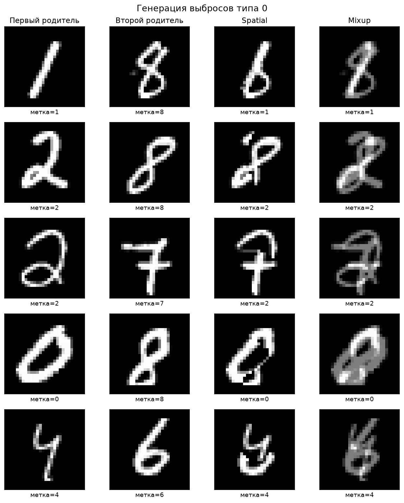

### 8.2. Лучшие конфигурации KNN и ODIN

В таблице приведена лучшая по `F1` конфигурация каждого метода. Число пропущенных выбросов равно количеству выбросов типа 1 для KNN и типа 2 для ODIN.

| Выборка | Метод | `k` | `T` | Precision | Recall | F1 | FPR | Пропущено |
|---|---|---:|---:|---:|---:|---:|---:|---:|
| Spatial | KNN | 3 | — | 53.17% | 52.80% | 52.99% | 4.65% | 472 типа 1 |
| Spatial | ODIN | 9 | 2 | 43.47% | 73.90% | **54.74%** | 9.61% | 261 типа 2 |
| Mixup | KNN | 5 | — | 51.23% | 60.20% | **55.36%** | 5.73% | 398 типа 1 |
| Mixup | ODIN | 1 | 12 | 9.09% | 100.00% | 16.67% | 100.00% | 0 типа 2 |
| Combined | KNN | 5 | — | 51.36% | 56.60% | **53.85%** | 5.36% | 434 типа 1 |
| Combined | ODIN | 9 | 1 | 33.24% | 36.50% | 34.80% | 7.33% | 635 типа 2 |

Для mixup лучший формальный результат ODIN получен при максимальном пороге `T=12`, когда выбросами объявлены вообще все 11 000 объектов. Поэтому `recall=100%` и число пропущенных выбросов равно нулю, но одновременно `FPR=100%`, а precision совпадает с долей выбросов в выборке — `1000/11000=9.09%`. Это вырожденное решение нельзя считать практически полезным.

Сводное сравнение лучших конфигураций показано на следующем графике:

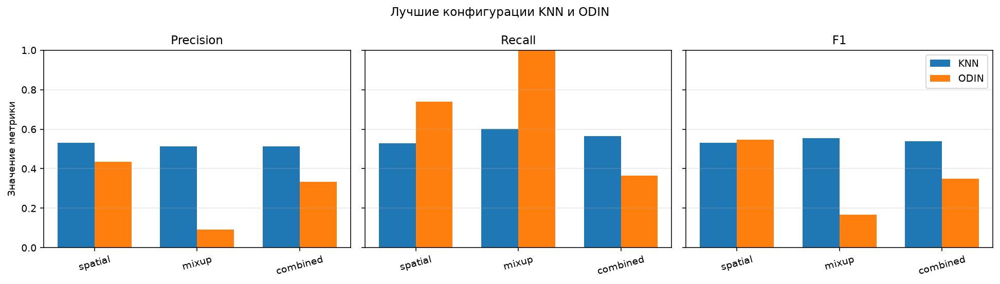

### 8.3. Влияние `k` на KNN

| Выборка | `k` | Precision | Recall | F1 | Выбросов типа 1 |
|---|---:|---:|---:|---:|---:|
| Spatial | 1 | 48.39% | 51.10% | 49.71% | 489 |
| Spatial | 3 | 53.17% | 52.80% | **52.99%** | 472 |
| Spatial | 5 | 51.53% | 52.10% | 51.82% | 479 |
| Spatial | 7 | 50.96% | 53.10% | 52.01% | 469 |
| Spatial | 9 | 49.44% | 52.80% | 51.06% | 472 |
| Mixup | 1 | 38.94% | 63.70% | 48.33% | 363 |
| Mixup | 3 | 47.45% | 62.40% | 53.91% | 376 |
| Mixup | 5 | 51.23% | 60.20% | **55.36%** | 398 |
| Mixup | 7 | 50.26% | 58.40% | 54.02% | 416 |
| Mixup | 9 | 50.17% | 57.80% | 53.72% | 422 |
| Combined | 1 | 42.27% | 59.10% | 49.29% | 409 |
| Combined | 3 | 48.91% | 58.60% | 53.32% | 414 |
| Combined | 5 | 51.36% | 56.60% | **53.85%** | 434 |
| Combined | 7 | 50.00% | 53.70% | 51.78% | 463 |
| Combined | 9 | 49.04% | 53.60% | 51.22% | 464 |

Для mixup и combined увеличение `k` от 1 до 5 уменьшает число ложных срабатываний и заметно повышает precision, хотя recall постепенно снижается. В результате максимум `F1` достигается при `k=5`. Для spatial зависимость менее выражена, а лучшим оказался `k=3`.

Минимальное число выбросов типа 1 не обязательно соответствует максимальному `F1`. Например, spatial-KNN при `k=7` пропускает 469 выбросов против 472 при `k=3`, но создаёт больше ложных срабатываний, поэтому его итоговый `F1` ниже.

### 8.4. Ранжирование ODIN без выбора порога

Средняя точность `AP` характеризует весь порядок объектов по показателю `-I_i` и не зависит от одного выбранного `T`.

| `k` | Spatial AP | Mixup AP | Combined AP |
|---:|---:|---:|---:|
| 1 | 15.53% | 6.42% | 9.08% |
| 3 | 27.16% | 5.90% | 12.82% |
| 5 | 35.79% | 5.56% | 16.09% |
| 7 | 42.46% | 5.37% | 18.69% |
| 9 | **47.17%** | 5.24% | **21.18%** |

Доля выбросов в каждой полной выборке составляет 9.09%, поэтому такое значение соответствует случайному базовому уровню precision-recall-ранжирования. Для spatial значение AP монотонно растёт вместе с `k` и намного превосходит базовый уровень. Для mixup оно, напротив, находится ниже базового уровня и уменьшается при росте `k`. Combined занимает промежуточное положение, поскольку содержит оба вида объектов.

### 8.5. Графики отдельных экспериментов

Для каждого эксперимента сохранены четыре представления результатов: метрики KNN в зависимости от `k`, карта `F1` ODIN по `k` и `T`, precision-recall-кривые ODIN и примеры выбросов типов 1 и 2 для лучших конфигураций.

#### Spatial

| KNN | ODIN: карта F1 |
|---|---|
| 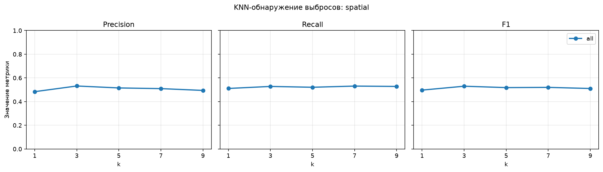 | 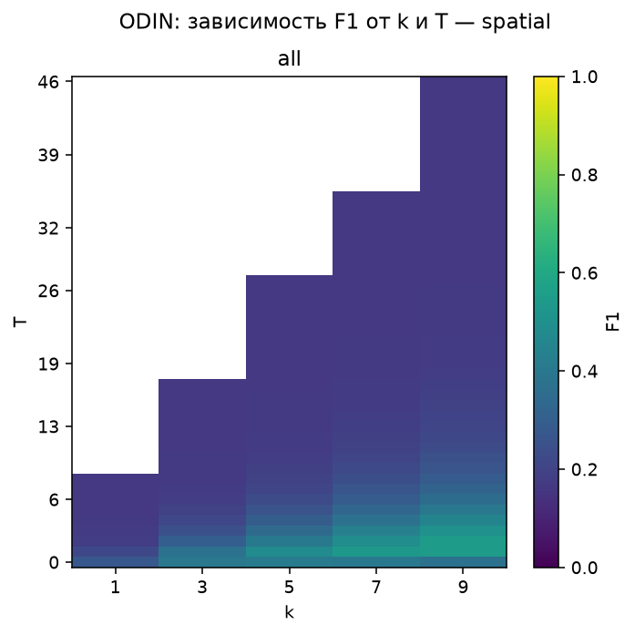 |

| ODIN: precision-recall | Пропущенные выбросы |
|---|---|
| 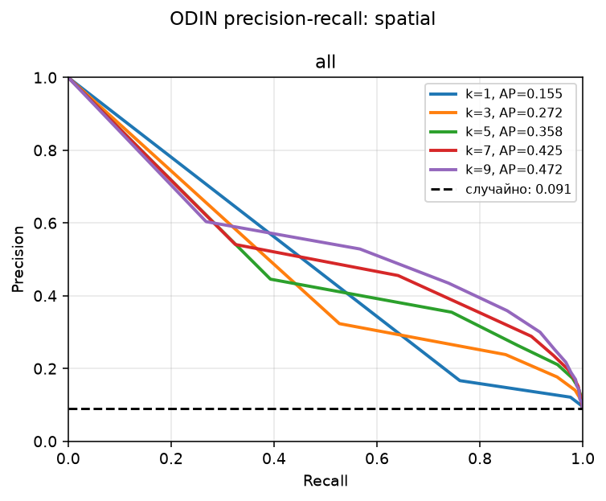 | 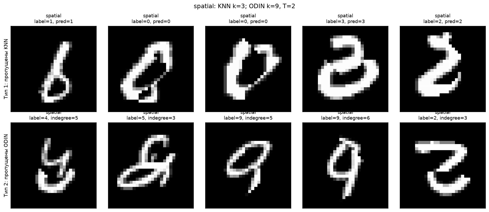 |

#### Mixup

| KNN | ODIN: карта F1 |
|---|---|
| 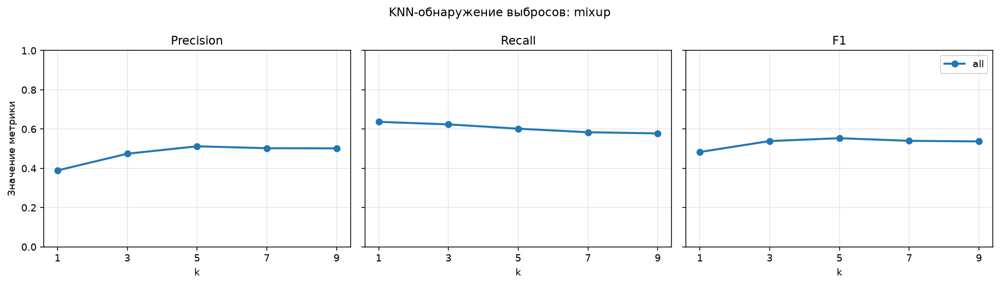 | 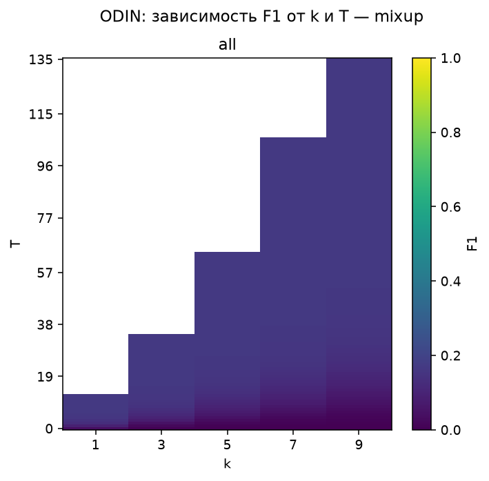 |

| ODIN: precision-recall | Пропущенные выбросы |
|---|---|
| 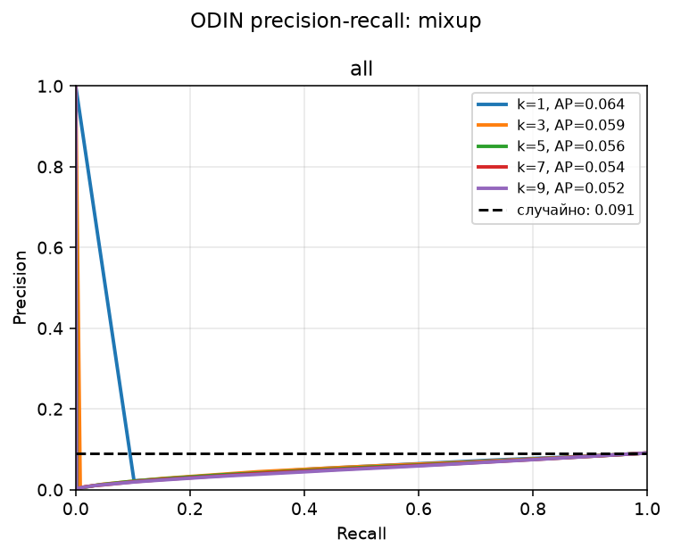 | 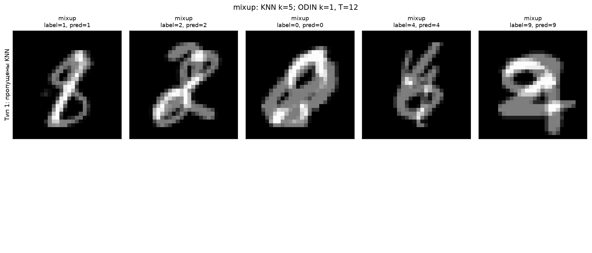 |

#### Combined

| KNN | ODIN: карта F1 |
|---|---|
| 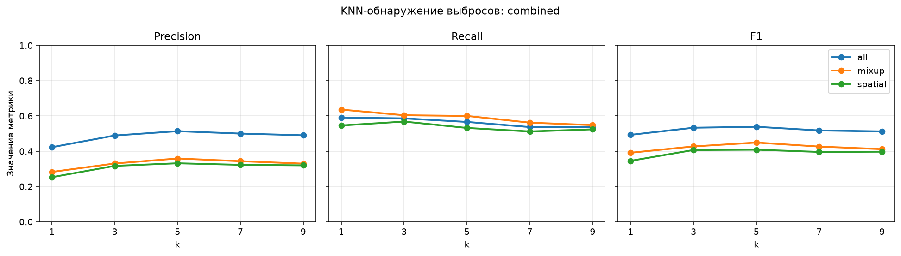 | 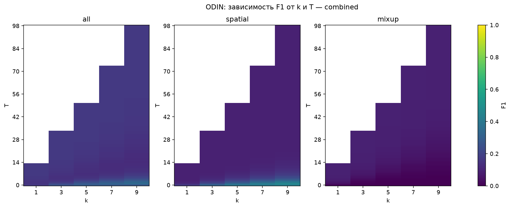 |

| ODIN: precision-recall | Пропущенные выбросы |
|---|---|
| 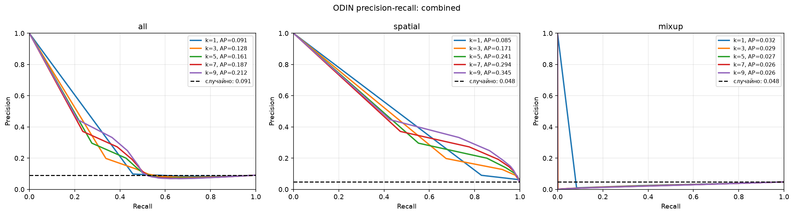 | 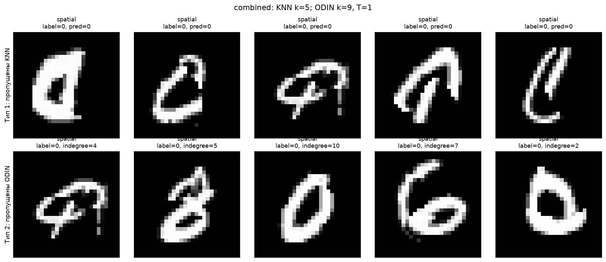 |

## 9. Наблюдения и закономерности задания № 5

### 9.1. Способ генерации определяет, что именно способен найти ODIN

ODIN основан не на визуальной необычности и не на несовпадении классов, а на конкретной топологической предпосылке: выброс редко выбирается соседом других объектов. Поэтому искусственно созданное изображение типа 0 не обязано обнаруживаться ODIN только потому, что человеку оно кажется странным.

Эта разница отчётливо видна по распределениям входящей степени при `k=9`:

| Выборка | Группа | Средняя степень | Медиана |
|---|---|---:|---:|
| Spatial | Обычные | 9.72 | 9 |
| Spatial | Выбросы | 1.84 | 1 |
| Mixup | Обычные | 8.00 | 7 |
| Mixup | Выбросы | 18.96 | 16 |
| Combined | Обычные | 8.64 | 8 |
| Combined | Spatial | 1.23 | 1 |
| Combined | Mixup | 24.02 | 21 |

Spatial-объекты почти не участвуют в локальных окрестностях, поэтому правило малой входящей степени соответствует их структуре. Mixup-объекты ведут себя противоположным образом: их входящая степень значительно выше, чем у обычных изображений.

### 9.2. ODIN хорошо ранжирует пространственные гибриды

Spatial-объект состоит из несовместимых частей двух цифр и часто располагается в малоплотной области пространства признаков. При `k=9` ODIN и пороге `T=2` обнаружил 739 из 1 000 таких объектов. Его recall составил 73.90%, а `F1=54.74%` немного превысил лучший результат KNN, равный 52.99%.

Увеличение `k` сделало оценку устойчивее: AP последовательно выросла с 15.53% при `k=1` до 47.17% при `k=9`. При малом `k` многие обычные изображения тоже имеют нулевую входящую степень, поэтому их трудно отличить от spatial-выбросов. Более широкий граф разделяет распределения лучше.

### 9.3. Mixup превращается в локальный центр, а не в изолированную точку

Mixup с `α=0.5` находится между изображениями двух классов. Такие объекты не оказались изолированными: наоборот, они образовали промежуточные точки, близкие сразу к нескольким областям выборки, и стали соседями большого количества изображений.

В результате направление ранжирования ODIN фактически оказалось обратным требуемому. При `k=9` средняя входящая степень mixup-выброса равна 18.96, тогда как у обычного изображения — 8.00. AP составляет лишь 5.24% при случайном базовом уровне 9.09%.

Формально лучший по `F1` порог пометил выбросами всю выборку. Этот результат показывает не ошибку программной реализации, а нарушение основной предпосылки метода. Классический ODIN ищет объекты с малой степенью и потому принципиально не предназначен для обнаружения аномальных локальных центров с высокой степенью.

### 9.4. KNN оказался менее чувствителен к геометрии выброса

Лучший `F1` KNN находится в узком диапазоне от 52.99% до 55.36% во всех трёх экспериментах. Причина состоит в том, что KNN использует другой сигнал: согласуются ли классы соседей с искусственно сохранённой меткой объекта.

Mixup обнаруживается KNN немного лучше spatial, несмотря на полный провал ODIN. Промежуточное изображение часто получает голоса класса второго родителя или третьего близкого класса, поэтому прогноз не совпадает с меткой первого родителя. Однако от 36.3% до 42.2% mixup-объектов в зависимости от `k` всё равно сохраняют исходный прогноз и становятся выбросами типа 1.

Цена такого подхода — зависимость от меток и смешение обнаружения аномалий с обычными ошибками классификации. Лучшие конфигурации KNN ошибочно объявляют выбросами от 4.65% до 5.73% чистых изображений.

### 9.5. Общий показатель смешанной выборки скрывает два противоположных режима

На combined-выборке лучшая конфигурация ODIN (`k=9`, `T=1`) обнаружила 365 из 1 000 выбросов. Дополнительный раздельный подсчёт показывает:

- обнаружено 365 из 500 spatial-объектов, то есть 73.0%;
- обнаружено 0 из 500 mixup-объектов;
- ошибочно отмечено 733 из 10 000 обычных изображений.

Следовательно, общий recall 36.5% не означает одинаково слабое обнаружение двух видов. Он является средним результатом почти нормальной работы на spatial и полного пропуска mixup. При анализе неоднородного набора выбросов необходимо сохранять результаты по подтипам, иначе механизм ошибки остаётся незаметным.

KNN на той же combined-выборке при `k=5` обнаружил 266 из 500 spatial- и 300 из 500 mixup-объектов. Его поведение между подтипами заметно однороднее.

### 9.6. Выбросы типов 1 и 2 не являются постоянными категориями изображений

Число пропусков меняется вместе с настройками детектора. Например, KNN обнаруживает больше mixup-объектов при `k=1`, чем при `k=9`, но при этом резко увеличивает количество ложных срабатываний и получает меньший `F1`. Аналогично, повышение `T` у ODIN уменьшает число выбросов типа 2, одновременно объявляя аномальными всё больше обычных изображений.

Поэтому минимизация количества выбросов типов 1 или 2 сама по себе недостаточна. В предельном случае можно устранить все пропуски, назвав выбросами всю выборку. Для содержательного сравнения необходимо одновременно учитывать precision, recall, `F1` и долю ложных срабатываний.

## 10. Общий вывод

В задании № 4 исследовано распознавание серых и бинарных изображений MNIST методом KNN. Лучшее качество 95.52% получено на исходных серых изображениях при взвешенном евклидовом расстоянии и `k=3`. Серое представление устойчивее бинарного к шуму, контурное искажение особенно сильно повреждает бинарные границы, а высокий порог бинаризации удаляет значительную часть полезного штриха.

В задании № 5 сформированы два сбалансированных пула по 1 000 выбросов типа 0 и три экспериментальные выборки. Реализованы два различных подхода к обнаружению: контролируемая проверка согласованности метки с KNN-прогнозом и не использующий метки графовый метод ODIN.

Эксперимент показал, что обнаружимость нельзя считать универсальным свойством визуально необычного изображения. Spatial hybrid соответствует предпосылке ODIN и имеет малую входящую степень; на нём ODIN достиг `F1=54.74%` и `AP=47.17%`. Mixup создаёт промежуточные объекты с высокой входящей степенью, поэтому классический ODIN с критерием `I_i≤T` не способен содержательно их выделить. KNN показал более стабильный `F1` около 53–55%, но потребовал меток и интерпретировал обычные ошибки классификации как аномалии.

Ни один из двух методов не оказался лучшим для всех форм выбросов. Результаты подтверждают, что алгоритм обнаружения следует выбирать в соответствии с ожидаемой геометрией аномалий, а качество необходимо проверять раздельно для разных подтипов. Выбросы типов 1 и 2 характеризуют не только сами изображения, но и ограничения выбранного детектора и его параметров.

## 11. Материалы и ссылки

### 11.1. Файлы проекта

- [`sample.ipynb`](sample.ipynb) — весь код подготовки данных, зашумления, KNN и массовых экспериментов;
- [`results/knn_results.csv`](results/knn_results.csv) — 2 325 численных результатов;
- [`results/figures`](results/figures/) — 93 итоговых графика;
- [`results/outliers/type0_pools.npz`](results/outliers/type0_pools.npz) — два пула по 1 000 выбросов типа 0;
- [`results/outliers/detection_results.csv`](results/outliers/detection_results.csv) — 1 335 строк с метриками KNN и ODIN;
- [`results/outliers/cache`](results/outliers/cache/) — кэш ближайших соседей для трёх выборок;
- [`results/outliers/figures`](results/outliers/figures/) — графики и примеры для задания № 5;
- [`data/mnist.npz`](data/mnist.npz) — локальная копия MNIST;
- `/home/mihanizzm/Downloads/mlnn.pdf`, с. 69–70 — формулировки заданий № 4 и № 5.

### 11.2. Документация использованных библиотек

- [scikit-learn: `NearestNeighbors`](https://scikit-learn.org/stable/modules/generated/sklearn.neighbors.NearestNeighbors.html);
- [NumPy: `concatenate`](https://numpy.org/doc/stable/reference/generated/numpy.concatenate.html);
- [NumPy: `where`](https://numpy.org/doc/stable/reference/generated/numpy.where.html);
- [NumPy: `reshape`](https://numpy.org/doc/stable/reference/generated/numpy.reshape.html);
- [NumPy: `bincount`](https://numpy.org/doc/stable/reference/generated/numpy.bincount.html);
- [SciPy: `scipy.stats.mode`](https://docs.scipy.org/doc/scipy/reference/generated/scipy.stats.mode.html);
- [scikit-learn: `average_precision_score`](https://scikit-learn.org/stable/modules/generated/sklearn.metrics.average_precision_score.html);
- [scikit-learn: `precision_recall_curve`](https://scikit-learn.org/stable/modules/generated/sklearn.metrics.precision_recall_curve.html).
